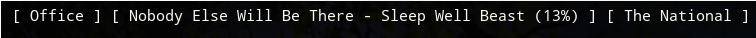
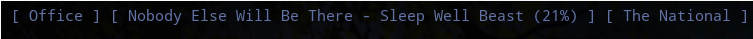

# squeezebox

Given a Logitech Media Server (squeezebox) and a player name, displays the current song/station and artist information in the bar. Clicking the info in the polybar can be used as a way to toggle play/pause.

Playing...


Paused...



## Example Config

You can use it as follows;

```ini
[module/squeezebox]
type = custom/script
exec = "~/projects/polybar-scripts/scripts/squeezebox/squeezebox 10.1.2.3 Office"
interval = 5
click-left = "~/projects/polybar-scripts/scripts/squeezebox/squeezebox 10.1.2.3 Office toggle"
```

The args to the script are as follows;

 * `lms_ip` the IP address of your squeezebox server
 * `player_name` the name of the player you want to track, as shown in your LMS player list
 * `toggle` \[optional\] if present will cause the player to toggle between play and pause state, so useful mostly as a click target

## Installation and Dependencies

Requires `python3` and `pysqueezebox` to work..

```bash
sudo apt install python3
pip3 install pysqueezebox
```
(or similar based on your distro)
